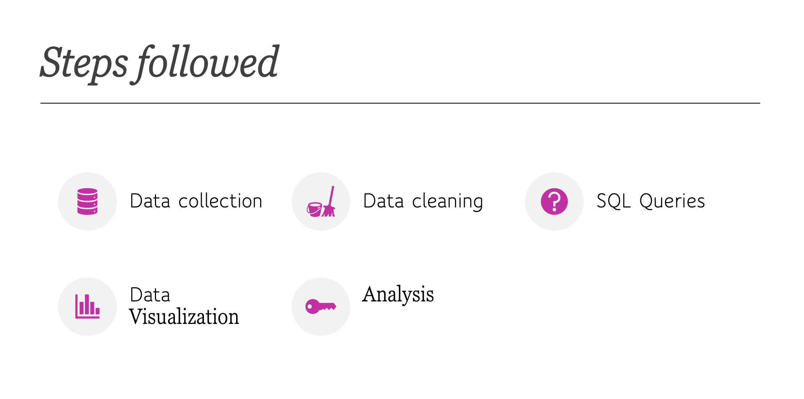
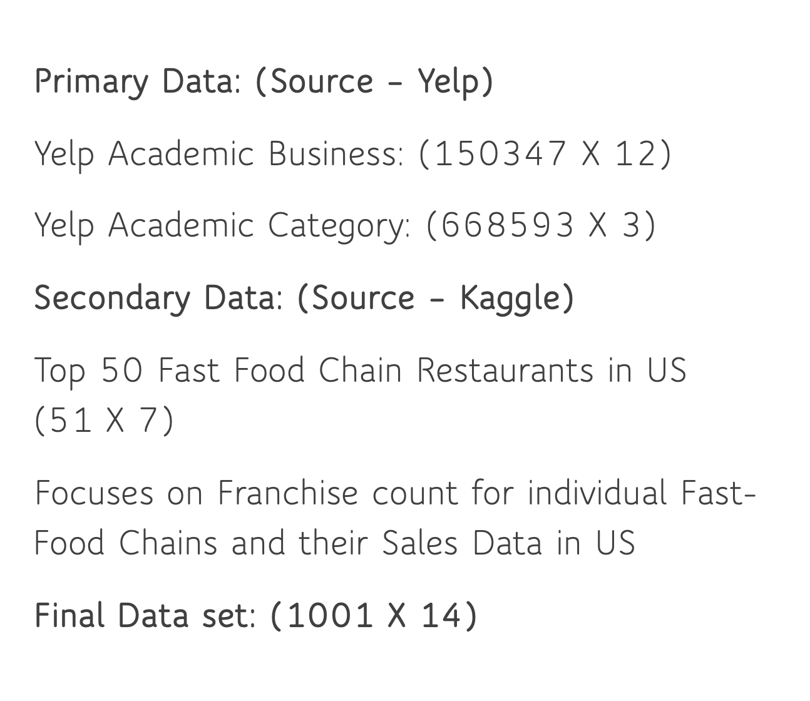
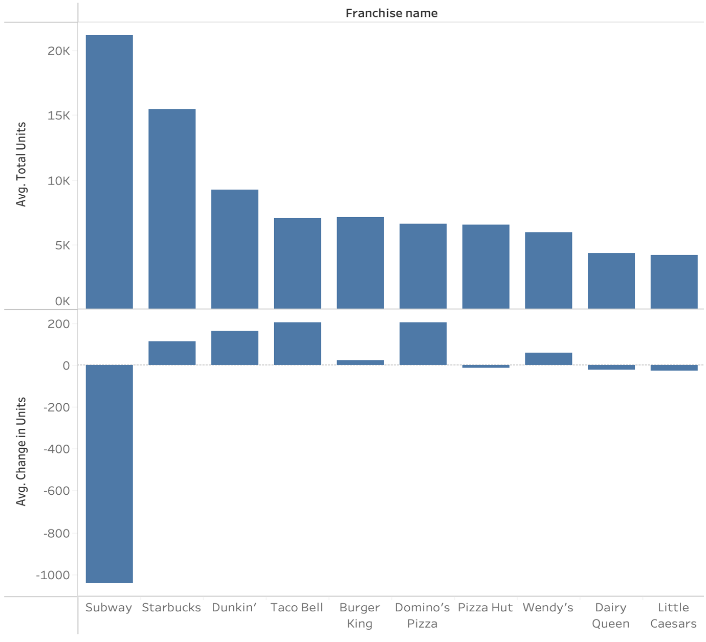

# Data Technology: COVID-19 Impact on U.S. Fast-Food Franchises

This project analyzes how the COVID-19 pandemic affected the operations of top U.S. fast-food chains using SQL and Tableau. Working with datasets from Yelp and Kaggle, we explored franchise unit changes, consumer behavior, and brand-level impact to derive actionable insights.
---

## 🧠 Business Questions Addressed

1. **How did franchise unit counts change before and after COVID-19?**
2. **Were some brands more resilient than others?**
3. **What influence did ratings and reviews have on franchise closures?**
4. **What trends emerged across states and franchise types?**

---

## 📁 Steps Followed

We followed a structured analytics pipeline:

---

## 🧪 Tools Used

- **MySQL Workbench** – For SQL querying and analysis  
- **Tableau** – For visual exploration and storytelling  
- **PowerPoint** – For presenting business insights

---

## 🧑‍💻 My Role

As part of a 4-member team, I contributed to SQL querying and led the analysis and visualization for the following key insights (Slides 12–15):

- Identified franchise chains with the highest unit count pre- and post-COVID  
- Calculated and visualized average change in franchise units  
- Analyzed the influence of ratings and reviews on franchise performance  
- Delivered Tableau dashboards to highlight state-wise impact

---

## 📊 Visual Insights

### 1️⃣ Dataset Overview

Primary data was sourced from Yelp Academic datasets, with secondary data from Kaggle's franchise database. The final dataset contained 1,001 observations and 14 variables.

### 2️⃣ Project Methodology

---

### 3️⃣ Change in Units for Top 10 Fast-Food Chains

Subway experienced the steepest decline in units, while chains like Taco Bell and Dunkin' saw growth — indicating uneven recovery across brands.

---
---

## 📂 Files Included

| File | Description |
|------|-------------|
| `PresentationDataTechnology.pdf` | Summary of business problem, SQL logic, and Tableau insights |
| `DataTechFinal.sql` | SQL code used in MySQL Workbench |
| `TableauViz.twbx` | Tableau packaged workbook |
| `*.png` | Project visuals (charts, steps, data overview)

📊 **Note:** [Download the Tableau visuals `.twbx`](./SQL_Tableau_YelpCOVIDAnalysis/TableauViz.twbx) to explore interactively in Tableau.

---

## ✅ Key Learning Outcomes

- Strengthened SQL skills for real-world data extraction and manipulation  
- Gained hands-on experience in **data storytelling** using Tableau  
- Improved ability to communicate technical findings to non-technical stakeholders  
- Learned to identify KPIs tied to real business challenges

---

## 📬 Let’s Connect!

If you're working on something interesting in analytics, optimization, or tech-driven innovation — I’d love to chat!

🔗 [LinkedIn](https://www.linkedin.com/in/armashaik/)  
💻 [More Projects](https://github.com/ArmaShaik)

---
